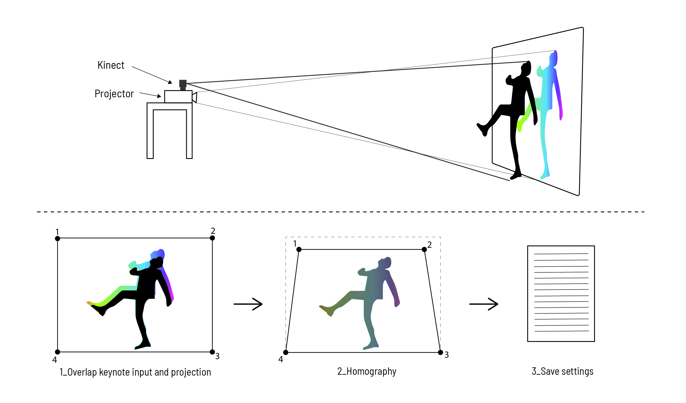
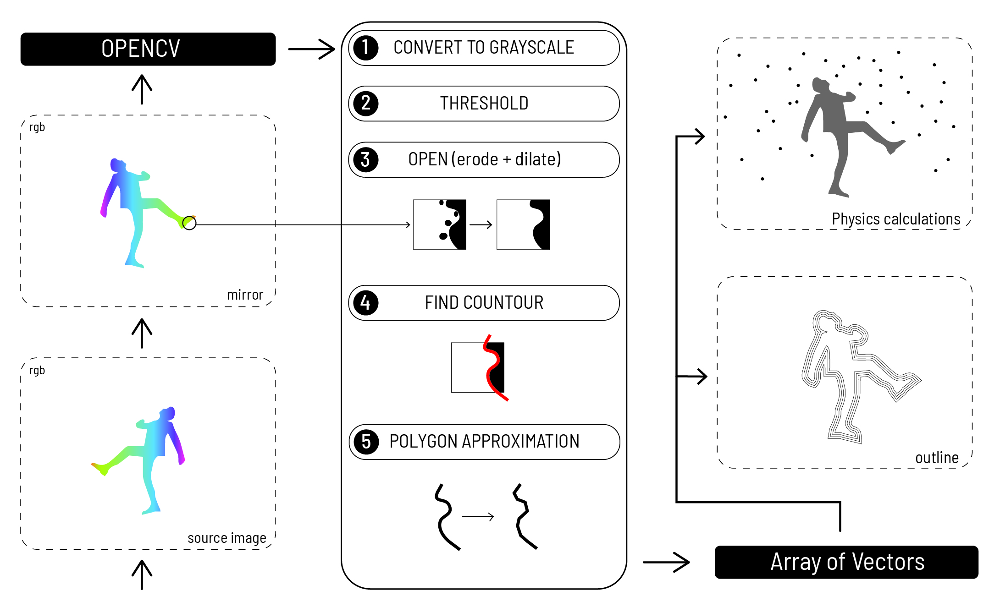

# Projection Mapping
## IAAC MRAC 19-20 | Hardware 2 | Group 2

### Description

Blablablablabla.


### References:

* [WITHOUTTITLE](https://www.liaworks.com/theprojects/withouttitle/)

### Process Description

**Basic Steps:**

Calibration of the setting:


Software workflow:


**Documentation:**

**1)** Blobs from OpenCV
(https://www.youtube.com/watch?v=LoU_e9nNRB8)

**1.1)** *Blob Quality*
[

**2)** Clean Outlines
(https://www.youtube.com/watch?v=uaYo_nu1j8A)

**3)** Calibration Homography
(https://www.youtube.com/watch?v=-CA7zrLlXVk)

**3.1)** *Calibration through Spout and Resolume Arena*


**3.1)** *Speed Test*
(https://www.youtube.com/watch?v=fbgv05gPEUY)

**3.2)** *Delay Test*
(https://www.youtube.com/watch?v=lHEGZzV15lw)

**4)** Clean Outlines Offsets
(https://www.youtube.com/watch?v=eJJTYA-iC-M)

**5)** Physics Engine Implementation
(https://www.youtube.com/watch?v=-C0LxvOYOOE)

#### Graphics Exploration

**6)** Vector Fields V1
.
.


.
.

Vector Fields V2


.
.

Vector Fields V3


.
.

Vector Fields V4


.
.

Vector Fields V5


.
.

Vector Fields V6


.
.

Vector Fields V7


.
.

### Requirements

**Processing Libraries:**

* *opencv*

* *KinectPV2*

* *spout**

* *Sound*

* *g4p_controls*

* *realSense**

**Not necessary*

**Graphics:**

This is Marta's part

#### Electronics and Hardware

This needs to be redone


Kinect2 + Video Projector Casio xj-a242
 *   


I don't know to put the code in order to be presentable.

 ```import ch.bildspur.realsense.*;
import ch.bildspur.realsense.type.ColorScheme;

import gab.opencv.*;
import org.opencv.core.*;
import org.opencv.calib3d.Calib3d;
import org.opencv.video.BackgroundSubtractorMOG;
import org.opencv.objdetect.CascadeClassifier;
import org.opencv.imgproc.Imgproc;

import KinectPV2.*;

import g4p_controls.*;

import spout.*;

public DepthCamera depthCamera;
public OpenCV opencv;
public Spout spout;

public GWindow controlWindow;

public int vertexId = 0;

public PVector vertices[] = new PVector[4];
public PVector texVertices[] = new PVector[4];

public PVector subVertices[] = new PVector[4];
public PVector subTexVertices[] = new PVector[4];

public PApplet controlApplet  = null;


/** Helpers, half and quarter of the main displays width and height **/
int w2;
int h2;
int w4;
int h4;


/** Primary graphics context, before projection transformations **/
public PGraphics graphics;
public PImage controlImg;


// MODE CONTROLS
// useKinect : true = Kinect camera, false = realSense camera
// useExternalDisplay : true = main graphics are fullscreen on second display, false = main graphics are windowed
// useSpout : true = send final graphics through spout, false = ignore spout
public boolean useKinect = true;
public boolean useExternalDisplay = true;
public boolean useSpout = false;

public void settings() {
  if (useExternalDisplay) {
    fullScreen(P2D, 2);
  } else {
    size(960, 540, P2D);
    //fullScreen(P2D);
  }

  println("Main Display Size : " + width + "x" + height);
}

public void setup() {
  setupSize();
  graphics = createGraphics(width, height);
  controlImg = createImage(width, height, ARGB);

  setupParticles();

  depthCamera = new DepthCamera(this, useKinect);

  setupControlWindow();

  if (useSpout) setupSpout();

  textureMode(NORMAL);

  opencv = new OpenCV(this, width, height);
}

public void draw() {
  background(0, 0, 50);

  PImage body = depthCamera.getBodyBlobImage();
  if (body != null) {
    image(body, (width - depthCamera.scaledWidth) / 2, (height - depthCamera.scaledHeight) / 2, depthCamera.scaledWidth, depthCamera.scaledHeight);
  }

  opencv.loadImage(get());


  graphics.beginDraw();
  //graphics.background(0);
  //if (body != null) {
  //  graphics.image(body, (width - depthCamera.scaledWidth) / 2, (height - depthCamera.scaledHeight) / 2, depthCamera.scaledWidth, depthCamera.scaledHeight);
  //  graphics.filter(THRESHOLD);
  //}


  //graphics = cvGetOutlines(graphics);
  ////updateParticles();

  //graphics.pushMatrix();
  //graphics.scale(-1,1);
  //graphics.image(graphics.get(),-graphics.width,0);
  //graphics.popMatrix();

  graphics.background(200);
  drawCircles(graphics);
  graphics.endDraw();

  controlImg = graphics.get();
  //controlImg.copy(graphics,0,0,graphics.width,graphics.height,0,0,graphics.width,graphics.height);

  background(0);
  fill(0);
  rect(0, 0, width, height);
  noFill();
  noStroke();

  drawProjection(this, graphics, 1);

  if (controlApplet != null) {
    //controlApplet.redraw();
  }

  if (useSpout) spout.sendTexture();

  if (frameCount % 100 == 0) {
    println(frameRate);
  }
}

/**
 Called during setup, also call again whenever size of main display changes.
 This will really only happen if it fails to correctly fullscreen on the second display at first
 **/
public void setupSize() {
  w2 = width / 2;
  h2 = height / 2;
  w4 = width / 4;
  h4 = height / 4;
  vertices[0] = new PVector(0, 0);
  vertices[1] = new PVector(width, 0);
  vertices[2] = new PVector(width, height);
  vertices[3] = new PVector(0, height);

  texVertices[0] = new PVector(0, 0);
  texVertices[1] = new PVector(1, 0);
  texVertices[2] = new PVector(1, 1);
  texVertices[3] = new PVector(0, 1);

  for (int i = 0; i < 4; i++) {
    subVertices[i] = new PVector(0, 0);
    subTexVertices[i] = new PVector(0, 0);
  }
}

public void setupSpout() {
  spout = new Spout(this);
  spout.createSender("Projection Mapping Source Graphics");
}
 ```


 **Credits**


 _Based on IAAC publishing guidelines:
 (Metal Rod Bending for ABB) is a project of IaaC, Institute for Advanced Architecture of Catalonia. developed at Master in Robotics and Advanced Construction in 2019-2020 by:
 Students: (Anna Batalle, Matt Gordon, Lorenzo Masini, Roberto Vargas)
 Faculty: (Angel Muñoz)_
